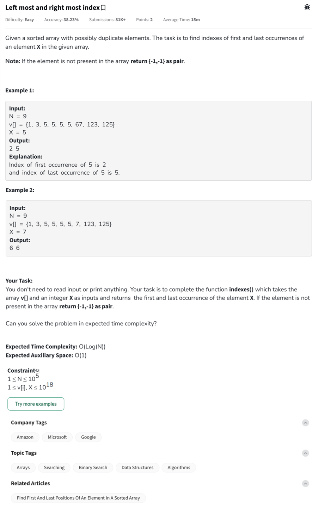

Question



---


This problem is asking us to **find the first and last index of a given element `X`** in a **sorted array `v[]` that may contain duplicates**.

---

### 🔍 Problem Breakdown:

* **Input**:

  * A sorted array `v[]` of size `N` (can have duplicates).
  * An integer `X`.

* **Output**:

  * A pair of integers representing the **first and last index** of `X` in `v[]`.
  * If `X` is **not found**, return `{-1, -1}`.

* **Example**:

  ```plaintext
  v = [1, 3, 5, 5, 5, 67, 123, 125]
  X = 5
  Output: 2 4  (first occurrence at index 2, last at index 4)
  ```

---

### 🧠 Approach:

We can **use binary search** twice:

1. To find the **first occurrence** of `X`
2. To find the **last occurrence** of `X`

This keeps the time complexity to **O(log N)**.

---

### ✅ Python Function:

```python
class Solution:
    def indexes(self, v, x):
        def findFirst():
            low, high = 0, len(v) - 1
            first = -1
            while low <= high:
                mid = (low + high) // 2
                if v[mid] == x:
                    first = mid
                    high = mid - 1  # search left half
                elif v[mid] < x:
                    low = mid + 1
                else:
                    high = mid - 1
            return first

        def findLast():
            low, high = 0, len(v) - 1
            last = -1
            while low <= high:
                mid = (low + high) // 2
                if v[mid] == x:
                    last = mid
                    low = mid + 1  # search right half
                elif v[mid] < x:
                    low = mid + 1
                else:
                    high = mid - 1
            return last

        first = findFirst()
        last = findLast()
        return [first, last]
```

---

### Code in **C++** or **JavaScript** too, with full program and comments.

Here's the complete implementation of the **"Leftmost and Rightmost Index"** problem in **Python**, **C++**, and **JavaScript** — all with full inline comments explaining the logic.

---

## ✅ Python (Full Program with Inline Comments)

```python
# Function to find first and last index of X in sorted array
class Solution:
    def indexes(self, v, x):
        def findFirst():
            low, high = 0, len(v) - 1
            first = -1
            while low <= high:
                mid = (low + high) // 2
                if v[mid] == x:
                    first = mid  # Store index and search left part
                    high = mid - 1
                elif v[mid] < x:
                    low = mid + 1
                else:
                    high = mid - 1
            return first

        def findLast():
            low, high = 0, len(v) - 1
            last = -1
            while low <= high:
                mid = (low + high) // 2
                if v[mid] == x:
                    last = mid  # Store index and search right part
                    low = mid + 1
                elif v[mid] < x:
                    low = mid + 1
                else:
                    high = mid - 1
            return last

        first = findFirst()
        last = findLast()
        return [first, last]

# Driver Code
if __name__ == "__main__":
    v = list(map(int, input().split()))
    x = int(input())
    ob = Solution()
    res = ob.indexes(v, x)
    print(res[0], res[1])
```

---

## ✅ C++ (Full Program with Inline Comments)

```cpp
#include <iostream>
#include <vector>
using namespace std;

class Solution {
public:
    pair<int, int> indexes(vector<int>& v, int x) {
        int first = -1, last = -1;
        int low = 0, high = v.size() - 1;

        // Find first occurrence
        while (low <= high) {
            int mid = (low + high) / 2;
            if (v[mid] == x) {
                first = mid;
                high = mid - 1; // Search left half
            } else if (v[mid] < x) {
                low = mid + 1;
            } else {
                high = mid - 1;
            }
        }

        low = 0, high = v.size() - 1;

        // Find last occurrence
        while (low <= high) {
            int mid = (low + high) / 2;
            if (v[mid] == x) {
                last = mid;
                low = mid + 1; // Search right half
            } else if (v[mid] < x) {
                low = mid + 1;
            } else {
                high = mid - 1;
            }
        }

        return {first, last};
    }
};

int main() {
    int n, x;
    cin >> n;
    vector<int> v(n);
    for (int i = 0; i < n; i++) cin >> v[i];
    cin >> x;

    Solution ob;
    pair<int, int> res = ob.indexes(v, x);
    cout << res.first << " " << res.second << endl;
    return 0;
}
```

---

## ✅ JavaScript (Full Program with Inline Comments)

```javascript
class Solution {
    indexes(v, x) {
        let first = -1, last = -1;
        let low = 0, high = v.length - 1;

        // Binary search for first occurrence
        while (low <= high) {
            let mid = Math.floor((low + high) / 2);
            if (v[mid] === x) {
                first = mid;
                high = mid - 1; // Move left
            } else if (v[mid] < x) {
                low = mid + 1;
            } else {
                high = mid - 1;
            }
        }

        low = 0;
        high = v.length - 1;

        // Binary search for last occurrence
        while (low <= high) {
            let mid = Math.floor((low + high) / 2);
            if (v[mid] === x) {
                last = mid;
                low = mid + 1; // Move right
            } else if (v[mid] < x) {
                low = mid + 1;
            } else {
                high = mid - 1;
            }
        }

        return [first, last];
    }
}

// Driver code
const readline = require('readline');
const rl = readline.createInterface({ input: process.stdin, output: process.stdout });

let inputLines = [];
rl.on('line', line => inputLines.push(line));
rl.on('close', () => {
    let v = inputLines[0].split(' ').map(Number);
    let x = parseInt(inputLines[1]);
    let ob = new Solution();
    let res = ob.indexes(v, x);
    console.log(res[0], res[1]);
});
```

---

Dry run for how this binary search works step by step:

Sure! Let’s walk through a **dry run** of the **"Leftmost and Rightmost Index"** problem using this input:

### 🧪 Example:

```
Input:
v = [1, 3, 5, 5, 5, 67, 123, 125]
x = 5
```

We’ll find:

* the **first occurrence** of 5 (leftmost index)
* the **last occurrence** of 5 (rightmost index)

---

## 🔍 Finding First Occurrence of 5

We perform a **binary search** to go **left** whenever we find `x`:

### Initial state:

* `low = 0`, `high = 7`, `first = -1`

### Iteration 1:

* `mid = (0 + 7) // 2 = 3`
* `v[mid] = 5`, which **matches** `x`

  * update `first = 3`
  * go **left**, so `high = 2`

### Iteration 2:

* `mid = (0 + 2) // 2 = 1`
* `v[mid] = 3 < 5`, go **right**, `low = 2`

### Iteration 3:

* `mid = (2 + 2) // 2 = 2`
* `v[mid] = 5`, which matches

  * update `first = 2`
  * go **left**, `high = 1`

Now `low > high`, loop exits.

✅ **First occurrence of 5 is at index 2**

---

## 🔍 Finding Last Occurrence of 5

Same logic, but when we find `x`, we go **right**:

### Initial state:

* `low = 0`, `high = 7`, `last = -1`

### Iteration 1:

* `mid = 3`, `v[mid] = 5`

  * update `last = 3`
  * go **right**, `low = 4`

### Iteration 2:

* `mid = (4 + 7) // 2 = 5`, `v[mid] = 67 > 5`, go **left**, `high = 4`

### Iteration 3:

* `mid = 4`, `v[mid] = 5`

  * update `last = 4`
  * go **right**, `low = 5`

Now `low > high`, loop exits.

✅ **Last occurrence of 5 is at index 4**

---

## ✅ Final Output:

```text
2 4
```


