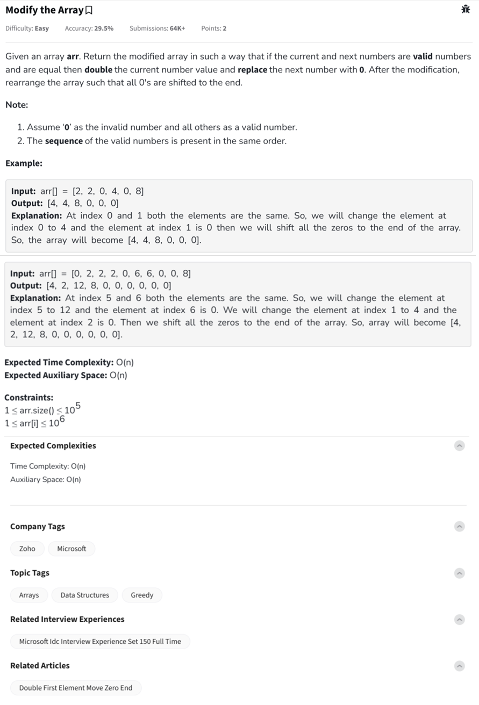

Question



---

### ✅ Problem Summary – "Modify the Array" (GeeksforGeeks)

You're given an array `arr[]`. You need to modify it as follows:

1. **If two adjacent valid (non-zero) elements are equal**,

   * **Double** the first one.
   * **Replace** the second one with **0**.

2. After completing this process across the array,

   * **Move all zeros to the end**, while keeping the order of valid (non-zero) numbers **intact**.

---

### 💡 Rules & Assumptions

* A number is **valid** if it is **not zero**.
* Perform changes in **original order**.
* **Only adjacent equal non-zero** values are combined.

---

### 🔍 Step-by-Step Dry Run

#### Example Input:

```python
arr = [0, 2, 2, 0, 6, 6, 0, 0, 8]
```

#### Step 1: Combine adjacent valid equals

* At index 1 and 2: `2 == 2` → `arr[1] = 4`, `arr[2] = 0` → `[0, 4, 0, 0, 6, 6, 0, 0, 8]`
* At index 4 and 5: `6 == 6` → `arr[4] = 12`, `arr[5] = 0` → `[0, 4, 0, 0, 12, 0, 0, 0, 8]`

#### Step 2: Shift all zeros to the end

→ Final: `[4, 12, 8, 0, 0, 0, 0, 0, 0]`

---

## 💻 Code Implementations (with Inline Comments)

---

### 🔸 Python

```python
class Solution:
    def modifyAndRearrange(self, arr):
        n = len(arr)
        
        # Step 1: Combine adjacent valid equal elements
        i = 0
        while i < n - 1:
            if arr[i] != 0 and arr[i] == arr[i + 1]:
                arr[i] *= 2       # Double the current
                arr[i + 1] = 0    # Replace next with 0
                i += 1            # Skip next as it's now 0
            i += 1

        # Step 2: Move all non-zero elements to the front
        result = []
        for num in arr:
            if num != 0:
                result.append(num)

        # Fill remaining positions with 0
        result += [0] * (n - len(result))
        return result


# Driver code
t = int(input())
for _ in range(t):
    arr = list(map(int, input().split()))
    res = Solution().modifyAndRearrange(arr)
    print(" ".join(map(str, res)))
```

---

### 🔸 C++

```cpp
#include <iostream>
#include <vector>
using namespace std;

class Solution {
public:
    vector<int> modifyAndRearrange(vector<int>& arr) {
        int n = arr.size();
        
        // Step 1: Double adjacent equal valid numbers
        for (int i = 0; i < n - 1; i++) {
            if (arr[i] != 0 && arr[i] == arr[i + 1]) {
                arr[i] *= 2;
                arr[i + 1] = 0;
                i++;  // Skip next
            }
        }

        // Step 2: Move non-zeros to front
        vector<int> result;
        for (int num : arr) {
            if (num != 0) result.push_back(num);
        }

        // Fill remaining with 0s
        while (result.size() < n) result.push_back(0);
        return result;
    }
};

// Driver code
int main() {
    int t;
    cin >> t;
    cin.ignore();
    while (t--) {
        string line;
        getline(cin, line);
        stringstream ss(line);
        int num;
        vector<int> arr;
        while (ss >> num) arr.push_back(num);

        Solution obj;
        vector<int> res = obj.modifyAndRearrange(arr);
        for (int x : res) cout << x << " ";
        cout << endl;
    }
    return 0;
}
```

---

### 🔸 JavaScript

```javascript
class Solution {
    modifyAndRearrange(arr) {
        const n = arr.length;

        // Step 1: Combine adjacent equal valid numbers
        for (let i = 0; i < n - 1; i++) {
            if (arr[i] !== 0 && arr[i] === arr[i + 1]) {
                arr[i] *= 2;
                arr[i + 1] = 0;
                i++;  // Skip next
            }
        }

        // Step 2: Move non-zeros to front
        let result = [];
        for (let i = 0; i < n; i++) {
            if (arr[i] !== 0) result.push(arr[i]);
        }

        while (result.length < n) result.push(0);
        return result;
    }
}


// Driver code
const readline = require('readline');
const rl = readline.createInterface({ input: process.stdin, output: process.stdout });

let inputLines = [], current = 0;
rl.on('line', line => inputLines.push(line.trim()));
rl.on('close', () => {
    let t = parseInt(inputLines[current++]);
    for (let i = 0; i < t; i++) {
        let arr = inputLines[current++].split(' ').map(Number);
        let obj = new Solution();
        let res = obj.modifyAndRearrange(arr);
        console.log(res.join(' '));
    }
});
```

---
