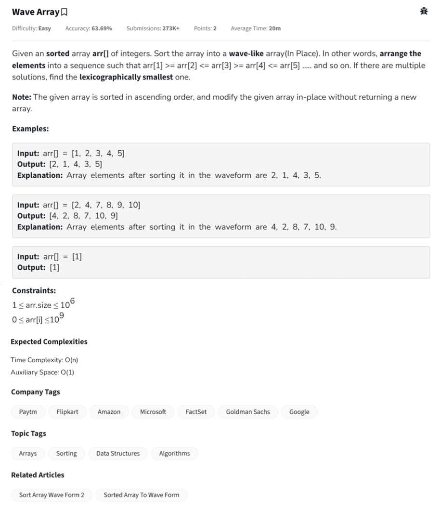

---

### 🔍 **What’s the Problem?**

You're given a **sorted array** (ascending order) of **distinct integers**.

You need to rearrange this array **in-place** to make it follow a **wave-like pattern**.

---

### 🌊 **What is a Wave-like Pattern?**

A wave-like pattern is where:

```
arr[0] >= arr[1] <= arr[2] >= arr[3] <= arr[4] ...
```

This means:

* Every **even-indexed element** (0, 2, 4, …) should be **greater than or equal to** its adjacent elements.
* Visually, the array should "go up then down then up then down…"

---

### ✅ **Rules and Constraints**

* The array is already sorted → you don’t need to sort it.
* All elements are **distinct** → no duplicates.
* **In-place transformation** → modify the given array itself, don’t return a new one.
* Your result should be the **lexicographically smallest** wave if multiple are possible.

---

### 📘 **Example:**

#### Input:

```python
arr = [1, 2, 3, 4, 5]
```

#### Output:

```python
[2, 1, 4, 3, 5]
```

#### Explanation:

* Initially sorted: `[1, 2, 3, 4, 5]`
* After making pairs:

  * Swap `1` and `2` → `[2, 1, 3, 4, 5]`
  * Swap `3` and `4` → `[2, 1, 4, 3, 5]`
* `5` is unpaired and left as is.

---

### 🧠 **Why This Works for Lexicographically Smallest?**

Because:

* You only swap **adjacent** elements.
* You start from the beginning (left to right).
* So the leftmost part of the array gets the smallest values possible while maintaining the wave pattern.

---

### 📌 Summary:

* **Input**: Sorted array of distinct integers
* **Task**: Rearrange in-place to follow the pattern:
  `arr[0] >= arr[1] <= arr[2] >= arr[3] <= arr[4] ...`
* **Approach**:
  Swap every **adjacent pair** starting from index `0`

---

Sure! Here's the **full program** for the **Wave Array problem** in **Python, C++, and JavaScript**, with **inline comments** explaining the logic and flow:

---

### ✅ Python Code

```python
class Solution:
    def convertToWave(self, arr, n):
        # Traverse array in steps of 2
        for i in range(0, n - 1, 2):
            # Swap current element with the next
            arr[i], arr[i + 1] = arr[i + 1], arr[i]

# Driver code for testing
if __name__ == "__main__":
    arr = [1, 2, 3, 4, 5]
    n = len(arr)
    Solution().convertToWave(arr, n)
    print(arr)  # Output: [2, 1, 4, 3, 5]
```

---

### ✅ C++ Code

```cpp
#include <iostream>
#include <vector>
using namespace std;

class Solution {
public:
    void convertToWave(int n, vector<int>& arr) {
        // Loop through the array in steps of 2
        for (int i = 0; i < n - 1; i += 2) {
            // Swap adjacent elements to create wave
            swap(arr[i], arr[i + 1]);
        }
    }
};

// Driver code
int main() {
    vector<int> arr = {1, 2, 3, 4, 5};
    int n = arr.size();

    Solution().convertToWave(n, arr);

    for (int i : arr) {
        cout << i << " ";
    }
    // Output: 2 1 4 3 5
    return 0;
}
```

---

### ✅ JavaScript Code

```javascript
class Solution {
    convertToWave(arr, n) {
        // Traverse array with step size of 2
        for (let i = 0; i < n - 1; i += 2) {
            // Swap arr[i] and arr[i + 1]
            [arr[i], arr[i + 1]] = [arr[i + 1], arr[i]];
        }
    }
}

// Driver code
const arr = [1, 2, 3, 4, 5];
const n = arr.length;

new Solution().convertToWave(arr, n);

console.log(arr);  // Output: [2, 1, 4, 3, 5]
```

---

### 🧠 Key Idea:

The array is already sorted, so to get the wave pattern:

* We swap every pair (0-1, 2-3, ...) to ensure the wave pattern: `arr[0] >= arr[1] <= arr[2] >= arr[3]` ...

Would you like this wave logic adapted to *unsorted* arrays too?

