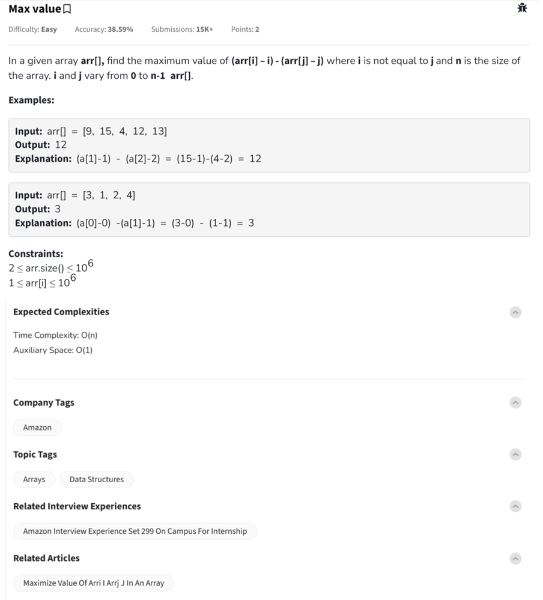

Question



---

Thanks for sharing the Max Value problem! Here's how to solve:

---

### 🧠 Problem Recap:

You're given an array `arr[]`. You need to find the **maximum value** of:

```
(arr[i] - i) - (arr[j] - j) for all i ≠ j
```

This can be rearranged to:

```
(arr[i] - i) - (arr[j] - j) = (arr[i] - i) - (arr[j] - j)
```

So, we just need the **maximum** and **minimum** of the expression `arr[k] - k` for all `k`, and subtract:

```
max(arr[k] - k) - min(arr[k] - k)
```

---

### ✅ Python Code (O(N))

```python
def maxValue(arr):
    max_diff = float('-inf')
    min_diff = float('inf')

    for i in range(len(arr)):
        val = arr[i] - i
        max_diff = max(max_diff, val)
        min_diff = min(min_diff, val)

    return max_diff - min_diff

# Example
print(maxValue([9, 15, 4, 12, 13]))  # Output: 12
print(maxValue([3, 1, 2, 4]))        # Output: 3
```

---

### ✅ C++ Code

```cpp
#include <iostream>
#include <vector>
#include <algorithm>
using namespace std;

int maxValue(const vector<int>& arr) {
    int max_diff = INT_MIN;
    int min_diff = INT_MAX;

    for (int i = 0; i < arr.size(); ++i) {
        int val = arr[i] - i;
        max_diff = max(max_diff, val);
        min_diff = min(min_diff, val);
    }

    return max_diff - min_diff;
}

int main() {
    vector<int> arr = {9, 15, 4, 12, 13};
    cout << maxValue(arr) << endl;  // Output: 12
    return 0;
}
```

---

### ✅ JavaScript Code

```javascript
function maxValue(arr) {
    let maxDiff = -Infinity;
    let minDiff = Infinity;

    for (let i = 0; i < arr.length; i++) {
        const val = arr[i] - i;
        maxDiff = Math.max(maxDiff, val);
        minDiff = Math.min(minDiff, val);
    }

    return maxDiff - minDiff;
}

// Example
console.log(maxValue([9, 15, 4, 12, 13])); // 12
console.log(maxValue([3, 1, 2, 4]));       // 3
```

---

### ✅ Time and Space Complexity

* **Time**: O(N)
* **Space**: O(1)

Would you like a visual illustration to see how `(arr[i] - i)` is calculated and tracked?
