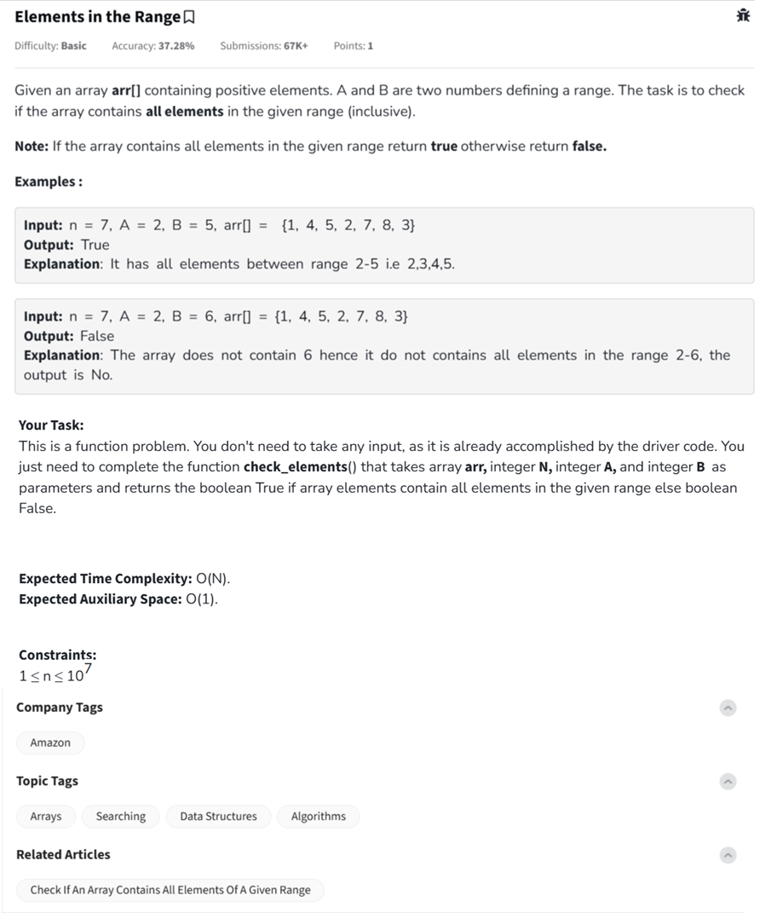

Question



---
Here's the solution for **"Elements in the Range"** in **Python**, **C++**, and **JavaScript**, complete with **inline comments** to explain the logic.

---

### ✅ Python

```python
def check_elements(arr, n, A, B):
    # Convert array to a set for O(1) average lookup time
    elements = set(arr)

    # Check every number from A to B is present in the set
    for i in range(A, B + 1):
        if i not in elements:
            return False  # If any number is missing, return False
    return True  # All numbers in range A to B are present
```

---

### ✅ C++

```cpp
#include <iostream>
#include <unordered_set>
#include <vector>
using namespace std;

bool check_elements(vector<int>& arr, int n, int A, int B) {
    unordered_set<int> elements;

    // Insert all array elements into the set
    for (int num : arr) {
        elements.insert(num);
    }

    // Check for all elements in range [A, B]
    for (int i = A; i <= B; ++i) {
        if (elements.find(i) == elements.end()) {
            return false;  // If any number is not found
        }
    }
    return true;  // All required elements found
}
```

---

### ✅ JavaScript

```javascript
class Solution {
    check_elements(arr, n, A, B) {
        // Use a Set to store unique elements
        const elements = new Set(arr);

        // Check every value from A to B
        for (let i = A; i <= B; i++) {
            if (!elements.has(i)) {
                return false; // If i is missing from the set
            }
        }
        return true; // All values found
    }
}

// Example usage:
// let sol = new Solution();
// console.log(sol.check_elements([1, 4, 5, 2, 7, 8, 3], 7, 2, 5));  // Output: true
```
