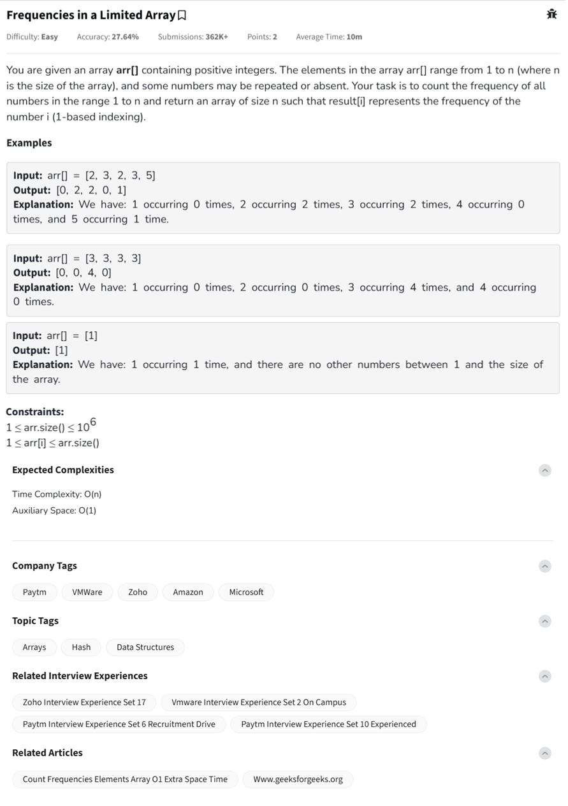

Question



---

### üìò **Problem Summary: Frequencies in a Limited Array**

Given an array `arr[]` of size `n`, where:

* Each element is in the range `1` to `n` (inclusive),
* Some elements may be repeated and some may be missing,

Your task is to:

* Count how many times each number from `1` to `n` occurs in the array,
* Return the **frequency array** of size `n`, where `result[i]` represents the count of `i+1`.

---

### 🧠 **Key Insight:**

We need to generate an output array `res[]` such that:

```python
res[i] = frequency of (i+1) in arr
```

---

### ‚úÖ Example Dry Run:

#### üì• Input:

```python
arr = [2, 3, 2, 3, 5]
n = 5
```

---

### 🧮 Step-by-Step Flow:

We initialize an array `res` of size `n` with all 0s:

```python
res = [0, 0, 0, 0, 0]
```

Now iterate through each number in `arr` and increment the count at index `num - 1`:

| Iteration | Current Element | Action                   | `res` After Update |
| --------- | --------------- | ------------------------ | ------------------ |
| 1         | 2               | Increment `res[1]`       | `[0, 1, 0, 0, 0]`  |
| 2         | 3               | Increment `res[2]`       | `[0, 1, 1, 0, 0]`  |
| 3         | 2               | Increment `res[1]` again | `[0, 2, 1, 0, 0]`  |
| 4         | 3               | Increment `res[2]` again | `[0, 2, 2, 0, 0]`  |
| 5         | 5               | Increment `res[4]`       | `[0, 2, 2, 0, 1]`  |

---

### üü© Final Output:

```python
[0, 2, 2, 0, 1]
```

üîπ This means:

* `1` occurred `0` times
* `2` occurred `2` times
* `3` occurred `2` times
* `4` occurred `0` times
* `5` occurred `1` time

---

### ⏱️ Time & Space Complexity:

* **Time Complexity**: `O(n)` (single pass)
* **Auxiliary Space**: `O(n)` (to store the result)

### Python/C++/JavaScript:

Absolutely! Here's a **summary of the corrected solutions** for the **"Frequencies in a Limited Array"** problem in **Python**, **C++**, and **JavaScript** — each with **inline comments explaining the logic**.

---

## ‚úÖ 1. Python Implementation

```python
class Solution:
    # Function to count the frequency of all elements from 1 to N in the array.
    def frequencyCount(self, arr):
        n = len(arr)

        # Initialize a frequency list with zeros
        freq = [0] * n

        # Count occurrences for values between 1 and n
        for num in arr:
            if 1 <= num <= n:
                freq[num - 1] += 1  # Map value x to index x-1

        return freq


# Driver code
t = int(input())  # Number of test cases
for _ in range(t):
    arr = list(map(int, input().split()))
    result = Solution().frequencyCount(arr)

    if result:
        print(" ".join(map(str, result)))
    else:
        print("[]")
```

---

## ‚úÖ 2. C++ Implementation

```cpp
#include <iostream>
#include <vector>
#include <sstream>
using namespace std;

class Solution {
public:
    // Function to count the frequency of all elements from 1 to N in the array.
    vector<int> frequencyCount(vector<int>& arr) {
        int N = arr.size();
        vector<int> freq(N, 0);  // Initialize frequency array with 0s

        for (int i = 0; i < N; i++) {
            if (arr[i] >= 1 && arr[i] <= N) {
                freq[arr[i] - 1]++;  // Adjust index to 0-based
            }
        }

        return freq;
    }
};

// Driver code
int main() {
    int t;
    cin >> t;
    cin.ignore();

    while (t--) {
        string input;
        getline(cin, input);
        stringstream ss(input);
        int num;
        vector<int> arr;

        while (ss >> num) {
            arr.push_back(num);
        }

        Solution obj;
        vector<int> result = obj.frequencyCount(arr);

        if (result.empty()) {
            cout << "[]";
        } else {
            for (int i = 0; i < result.size(); i++) {
                if (i != 0) cout << " ";
                cout << result[i];
            }
        }
        cout << endl;
    }

    return 0;
}
```

---

## ‚úÖ 3. JavaScript Implementation

```javascript
class Solution {
    // Function to count the frequency of all elements from 1 to N in the array.
    frequencyCount(arr) {
        const N = arr.length;
        const freq = new Array(N).fill(0);  // Initialize frequency array

        for (let i = 0; i < N; i++) {
            if (arr[i] >= 1 && arr[i] <= N) {
                freq[arr[i] - 1]++;  // Convert value to index
            }
        }

        return freq;
    }
}

// Driver Code
'use strict';

process.stdin.resume();
process.stdin.setEncoding('utf-8');

let inputString = '';
let currentLine = 0;

process.stdin.on('data', inputStdin => { inputString += inputStdin; });

process.stdin.on('end', _ => {
    inputString = inputString.trim().split('\n').map(line => line.trim());
    main();
});

function readLine() {
    return inputString[currentLine++];
}

function main() {
    const t = parseInt(readLine());
    for (let i = 0; i < t; i++) {
        const arr = readLine().split(' ').map(Number);
        const obj = new Solution();
        const result = obj.frequencyCount(arr);

        if (result.length > 0) {
            console.log(result.join(' '));
        } else {
            console.log("[]");
        }
    }
}
```

---

### üîç Common Logic Summary:

* Each language uses:

  * A result array of size `N` initialized with 0s.
  * Iterates through input and counts how many times values `1..N` appear.
  * Maps value `x` to index `x - 1` to store the count.
* The output is the frequency of each number from 1 to N.

Would you like the space-optimized O(1) version that reuses the original array?

