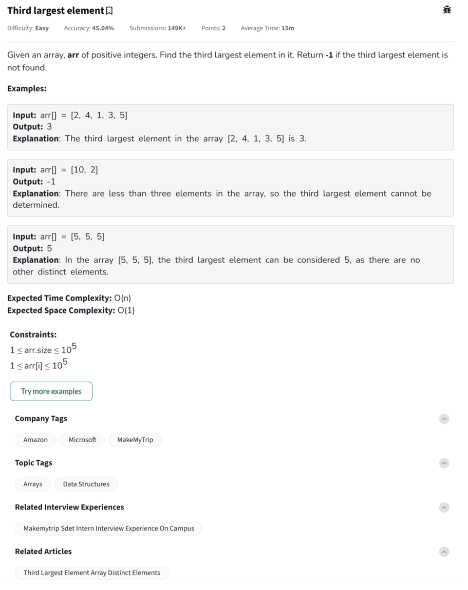

Question



---

Here’s a complete breakdown and implementation of the **"Third Largest Element"** problem in **Python**, **C++**, and **JavaScript**, following your specified formats.

---

## ✅ Problem Summary

Given an array of positive integers `arr[]`, find the third largest element.

* If the third largest **distinct** element doesn't exist, return `-1`.
* If all elements are the same (e.g., \[5, 5, 5]), then the third largest is the same as the first.

---

## 🔍 Step-by-Step Dry Run

### Example:

Input:
`arr = [2, 4, 1, 3, 5]`

### Goal:

Find the **third largest distinct** element.

### Steps:

1. Remove duplicates: `{1, 2, 3, 4, 5}`
2. Sort in descending: `[5, 4, 3, 2, 1]`
3. Pick 3rd element: `3`

### Output: `3`

---

## ✅ Python Code

```python
class Solution:
    def thirdLargest(self, arr):
        # Create a set to remove duplicates
        unique = list(set(arr))

        # If less than 3 distinct elements, return -1
        if len(unique) < 3:
            return -1

        # Sort in descending and return the 3rd element
        unique.sort(reverse=True)
        return unique[2]

# Driver Code
if __name__ == '__main__':
    t = int(input())
    for _ in range(t):
        arr = list(map(int, input().strip().split()))
        print(Solution().thirdLargest(arr))
        print("~")
```

---

## ✅ C++ Code

```cpp
class Solution {
  public:
    int thirdLargest(vector<int> &arr) {
        // Use set to remove duplicates
        set<int> s(arr.begin(), arr.end());

        // If fewer than 3 elements, return -1
        if (s.size() < 3) return -1;

        // Convert to vector and sort in descending
        vector<int> unique(s.begin(), s.end());
        sort(unique.rbegin(), unique.rend());
        return unique[2];
    }
};

// Driver Code
int main() {
    int t;
    cin >> t;
    cin.ignore();
    while (t--) {
        vector<int> arr;
        string input;
        getline(cin, input);
        stringstream ss(input);
        int number;
        while (ss >> number) {
            arr.push_back(number);
        }

        Solution ob;
        cout << ob.thirdLargest(arr) << endl;
        cout << "~" << endl;
    }
    return 0;
}
```

---

## ✅ JavaScript Code

```javascript
class Solution {
    thirdLargest(arr) {
        // Create Set to remove duplicates
        let unique = Array.from(new Set(arr));

        // If less than 3 unique elements
        if (unique.length < 3) return -1;

        // Sort descending
        unique.sort((a, b) => b - a);
        return unique[2];
    }
}

// Driver Code
'use strict';
process.stdin.resume();
process.stdin.setEncoding('utf-8');

let inputString = '';
let currentLine = 0;
process.stdin.on('data', inputStdin => { inputString += inputStdin; });
process.stdin.on('end', _ => {
    inputString = inputString.trim().split('\n');
    main();
});
function readLine() { return inputString[currentLine++]; }

function main() {
    let t = parseInt(readLine());
    for (let i = 0; i < t; i++) {
        let arr = readLine().split(' ').map(Number);
        let obj = new Solution();
        console.log(obj.thirdLargest(arr));
        console.log("~");
    }
}
```

---
