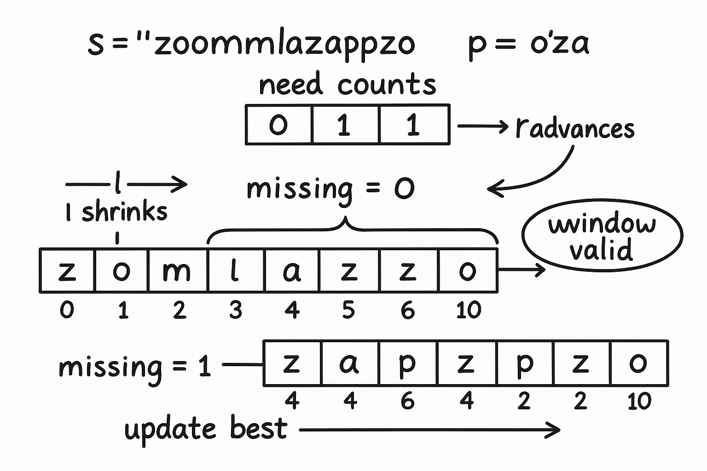

---
# Smallest Window Containing All Characters

**Difficulty:** Hard
**Accuracy:** 30.19%
**Submissions:** 179K+
**Points:** 8
**Average Time:** 30m

---

## Problem Statement

Given two strings **s** and **p**, find the **smallest substring** in `s` consisting of all the characters (**including duplicates**) of the string `p`.
Return an empty string if no such substring is present.

If there are multiple substrings of the same length found, return the one with the **least starting index**.

---

## Examples

### Example 1

**Input:**
`s = "timetopractice", p = "toc"`
**Output:**
`"toprac"`
**Explanation:**
"toprac" is the smallest substring in which "toc" can be found.

---

### Example 2

**Input:**
`s = "zoomlazapzo", p = "oza"`
**Output:**
`"apzo"`
**Explanation:**
"apzo" is the smallest substring in which "oza" can be found.

---

### Example 3

**Input:**
`s = "zoom", p = "zooe"`
**Output:**
`""`
**Explanation:**
No substring is present containing all characters of `p`.

---

## Constraints

* `1 ≤ s.length(), p.length() ≤ 10⁶`
* `s` and `p` consist of lowercase English letters only

---

## Expected Complexities

* **Time Complexity:** O(n)
* **Auxiliary Space:** O(1)

---

## Company Tags

Flipkart, Amazon, Microsoft, MakeMyTrip, Google, Streamoid Technologies, Media.net, Atlassian

---

## Topic Tags

* Sliding Window
* Hash
* Strings
* Dynamic Programming
* Binary Search

---

## Related Interview Experiences

* MakeMyTrip Interview Experience Set 1
* Amazon Interview Experience Set 315
* Streamoid Technologies Interview Experience Set 1 For Freshers
* MakeMyTrip Interview Experience Set 3
* MakeMyTrip Interview Experience Set 2 Campus
* Direct Interview Experience Set 22 Pool Campus
* Flipkart Interview Set 5 Off Campus
* Flipkart Interview Set 2 For SDE 1

---

## Related Articles

* [Find The Smallest Window In A String Containing All Characters Of Another String](https://www.geeksforgeeks.org/find-the-smallest-window-in-a-string-containing-all-characters-of-another-string/)

---

---
awesome—this is the classic **minimum window substring** (with duplicates). here’s everything you need for interviews.

---

## 2) Explanation + step-by-step dry run

### Goal

Find the **shortest substring of `s`** that contains **all chars of `p` (including duplicates)**.
If more than one has the same length, return the one with the **smallest starting index**.
If none exists, return `""`.

### Sliding-window idea (most expected)

* Keep counts of what we **need** from `p`.
* Expand the right end `r` of the window; track how many characters are **still missing** (across duplicates).
* When **nothing is missing**, try to **shrink from the left `l`** to make it minimal.
* Update the best answer whenever we have a valid window.
  Tie-break by length first, then by earlier start.

Because the prompt says lowercase letters, we can use a fixed array of size **26** → **O(1)** extra space.

#### Dry run (s = `"zoomlazapzo"`, p = `"oza"`)

Need counts: `{o:1, z:1, a:1}` → `missing = 3`.

* right=0 `'z'`: need z → missing=2, window `[0,0] = "z"`.
* right=1 `'o'`: need o → missing=1, window `"zo"`.
* right=2 `'o'`: extra o, missing still 1.
* right=3 `'m'`: not needed.
* right=4 `'l'`: not needed.
* right=5 `'a'`: need a → **missing=0**. Now shrink from left:

  * window is `"zoomla"` (0..5). Move `l` while valid:

    * left=0 `'z'` is needed and currently just satisfied → if we drop it, window invalid → stop.
  * Best so far: `"zoomla"`.
* right=6 `'z'`: extra z appears; shrink:

  * Now we can move `l`:

    * drop left=0 `'z'` (still have another z) → left=1
    * drop left=1 `'o'` (still have one more o at right=2) → left=2
    * drop left=2 `'o'` would break o → stop → window `"mla z"` actually indices [3..6] -> `"mlaz"`; best becomes `"mlaz"`.
* right=7 `'a'`: extra a; shrink:

  * move left=2 `'o'`? we’re at left=3 now; try removing left=3 `'m'` (not needed) → left=4
  * left=4 `'l'` (not needed) → left=5
  * left=5 `'a'` (needed but we have extra) → left=6
  * current window `[6..7] = "za"` is missing `o` → stop. Best still `"mlaz"`.
* right=8 `'p'`: not needed.
* right=9 `'z'`: extra z.
* right=10 `'o'`: now window `[6..10] = "zapzo"` has all; shrink:

  * left=6 `'z'` extra → left=7
  * left=7 `'a'` needed exactly (if drop, invalid) → stop → `"apzo"`
    Best becomes **`"apzo"`** (length 4). End → answer `"apzo"`.

---

## 3) Python solutions (brute + optimized)

### A) Optimized sliding window (array counts, O(n) time, O(1) space)

```python
class Solution:
    def smallestWindow(self, s: str, p: str) -> str:
        """
        Sliding-window with fixed-size counts (lowercase only).
        missing = total number of characters from p still needed across duplicates.
        Time  : O(n)
        Space : O(1)  (26-sized arrays)
        """
        n, m = len(s), len(p)
        if m == 0:
            return ""
        if m > n:
            return ""

        def idx(c):  # map 'a'..'z' -> 0..25
            return ord(c) - 97

        need = [0] * 26
        for ch in p:                      # O(m)
            need[idx(ch)] += 1

        have = [0] * 26                   # window counts
        missing = m                       # how many total chars still needed (with duplicates)

        best_len = float("inf")
        best_left = 0
        left = 0

        for right, ch in enumerate(s):        # O(n)
            right_id = idx(ch)
            have[right_id] += 1
            if have[right_id] <= need[right_id]:
                # this char satisfied one required instance
                missing -= 1

            # when window covers all required characters, shrink from left
            while missing == 0:
                # update best (tie-break by earliest start)
                curr_len = right - left + 1
                if curr_len < best_len or (curr_len == best_len and left < best_left):
                    best_len = curr_len
                    best_left = left

                # try removing s[left]
                left_id = idx(s[left])
                have[left_id] -= 1
                if have[left_id] < need[left_id]:
                    # we just made the window invalid; need to expand again
                    missing += 1
                left += 1

        return "" if best_len == float("inf") else s[best_left:best_left + best_len]
```

### B) Optimized sliding window (dictionary/Counter version — generic alphabet)

```python
from collections import Counter

class SolutionDict:
    def smallestWindow(self, s: str, p: str) -> str:
        """
        Same logic using Counter; works for any characters.
        Time  : O(n)
        Space : O(k) where k = distinct chars in p  (bounded for lowercase)
        """
        if len(p) > len(s):
            return ""

        need = Counter(p)     # required counts per character
        missing = len(p)      # total required across duplicates
        have = Counter()

        left = 0
        best_len = float("inf")
        best_left = 0

        for right, ch in enumerate(s):
            have[ch] += 1
            if have[ch] <= need[ch]:
                missing -= 1

            while missing == 0:
                # update best window
                curr_len = right - left + 1
                if curr_len < best_len or (curr_len == best_len and l < best_left):
                    best_len = curr_len
                    best_left = left

                # move left end
                left_ch = s[left]
                have[left_ch] -= 1
                if have[left_ch] < need[left_ch]:
                    missing += 1
                left += 1

        return "" if best_len == float("inf") else s[best_left:best_left + best_len]
```

### C) Brute force (expand from each start until covers `p`) — **not recommended**, but good baseline

```python
class SolutionBrute:
    def smallestWindow(self, s: str, p: str) -> str:
        """
        For each left index, extend right until all p chars covered.
        Early-stop if current window already worse than best.
        Time  : O(n^2) worst-case
        Space : O(1) (26-sized counts for lowercase)
        """
        if len(p) > len(s):
            return ""

        def idx(c): return ord(c) - 97
        need = [0] * 26
        for ch in p:
            need[idx(ch)] += 1

        best_len = float("inf")
        best_left = 0

        for left in range(len(s)):
            have = [0] * 26
            missing = len(p)
            # prune: if remaining length < best_len, we can stop early
            if len(s) - l >= best_len:
                pass
            for right in range(left, len(s)):
                j = idx(s[right])
                have[j] += 1
                if have[j] <= need[j]:
                    missing -= 1
                if missing == 0:
                    curr_len = right - left + 1
                    if curr_len < best_len or (curr_len == best_len and l < best_left):
                        best_len, best_left = curr_len, left
                    break  # smallest for this l
        return "" if best_len == float("inf") else s[best_left:best_left + best_len]
```

---

## 4) Interviewer-style Q&A

**Q1. Why do we track `missing` (total required chars) instead of number of matching types?**
Because duplicates matter. `missing` counts **every required occurrence** (e.g., for `p="aab"`, you must see two `a`s and one `b`), not just distinct characters.

**Q2. Why can we clamp to 26 and claim O(1) space?**
The prompt restricts to **lowercase English letters**, so frequency arrays are fixed length 26 → constant extra space.

**Q3. How do you ensure the “least starting index” tie-break?**
When two windows have the same length, compare starts:
`if curr_len == best_len and l < best_left: update`.
Also, shrinking from the left until the window just becomes invalid ensures minimality for that right end.

**Q4. What’s the overall complexity?**
Sliding window: each index enters/leaves the window at most once → **O(n)** time.
Space: **O(1)** with 26-array (or **O(k)** with dict, `k` distinct chars in `p`).

**Q5. Common pitfalls?**

* Forgetting **duplicates** (only tracking distinct chars).
* Moving `left` without decreasing counts → window remains “valid” when it shouldn’t.
* Returning `-1` vs `""` (follow the prompt here: return `""`).
* Not handling `len(p) > len(s)` early.

**Q6. How would you adapt for unicode or case-sensitive strings?**
Use the **dict/Counter** version (Solution B) — same logic, flexible alphabet.

---

---

Excellent 👏 — this question (**“Smallest Window Containing All Characters”**) is one of Microsoft’s *favorite string+sliding window* interview topics.
Below is a curated list of **actual and pattern-based questions** Microsoft (and similar-level companies) typically ask around this problem — including *variations, conceptual probes, and follow-up challenges*.

---

## 🧠 Microsoft Interview Focus Around This Problem

### 💡 Stage 1: Understanding the Problem

They begin by testing **your grasp of the sliding-window concept** and **reasoning about duplicates**.

**Q1.** What is the difference between “contains all characters of `p`” vs “contains all distinct characters of `p`”?

**A1.**

* *All characters* means **including duplicates** (e.g., `p="aab"` needs two `a`s).
* *All distinct characters* means just the unique set (`a` and `b`).
  Missing this distinction is a common pitfall — Microsoft interviewers watch for it.

**Q2.** How do you track duplicates efficiently?

**A2.** Use a **count array or dictionary** to store how many times each character is still needed, and a single variable `missing` to track how many total characters are yet to be satisfied.

**Q3.** Why can we use two pointers instead of brute-force nested loops?

**A3.** Because both `left` and `right` move **monotonically** (each moves forward at most once), giving **O(n)** total work instead of **O(n²)**.

---

### 🧩 Stage 2: Algorithm Design and Edge Handling

They now move into reasoning about correctness and edge cases.

**Q4.** What happens when multiple smallest windows exist?
**A4.** Return the one with **least starting index** — track `(length, start)` pair and compare lexicographically.

**Q5.** What’s your approach if `p` has characters not in `s`?
**A5.** No valid window exists → return `""`. You can detect this early if any character in `p` isn’t in `s`.

**Q6.** How would you adapt your approach for **uppercase + lowercase letters** or **Unicode**?
**A6.** Use a `Counter` (dictionary) instead of a fixed-size array.

* For lowercase-only, array is O(1) (26 chars).
* For variable alphabet, dictionary keeps space O(k), k = distinct characters.

**Q7.** How do you ensure that when you move `left`, the window remains minimal?
**A7.**

* Keep shrinking `left` while the window still covers all required characters (`missing == 0`).
* Stop when removing `s[left]` makes the window invalid (need that char again).

---

### ⚙️ Stage 3: Performance and Optimization

**Q8.** What is the time and space complexity of your algorithm?
**A8.**

* **Time:** O(n) — both `left` and `right` traverse string once.
* **Space:** O(1) for lowercase (26-size array), or O(k) for `Counter`.

**Q9.** Can you modify this to return the **count of smallest windows** (not just one)?
**A9.** Yes — keep scanning; whenever a new window matches the smallest length, increment a counter.

**Q10.** If the strings are **streamed** (characters arriving in real-time), can your approach still work?
**A10.**
Yes — maintain a moving window using the same counts.
However, you may not know if you can ever reach completion unless you have a known `p`. This conceptually leads to **online sliding-window** logic (e.g., using a queue).

---

### 🔁 Stage 4: Real-World or “Stretch” Variants

These are often the **follow-up challenges** Microsoft asks if you solve the base problem quickly:

| Variant                                                           | Description                                                                                                               |
| ----------------------------------------------------------------- | ------------------------------------------------------------------------------------------------------------------------- |
| **1️⃣ Longest Substring Without Repeating Characters**            | Flip the logic: instead of matching counts, forbid duplicates; classic window with a `set`.                               |
| **2️⃣ Minimum Window Subsequence**                                | Characters of `p` must appear **in order**, not just as a set. (Requires dynamic sliding window or DP.)                   |
| **3️⃣ Smallest Window Containing All Distinct Characters of `s`** | Instead of `p`, require all unique letters of `s`.                                                                        |
| **4️⃣ Case-Insensitive or Unicode Input**                         | Replace array indexing with dict; test comprehension of generalization.                                                   |
| **5️⃣ Multi-pattern Search**                                      | Given multiple `p` strings, find shortest substring containing all of them → move toward **Trie + sliding window** logic. |

---

## 🧩 Microsoft Follow-Up “Why” Questions

These are **critical thinking prompts**:

* “Why do we decrement `missing` only if `have[c] <= need[c]`?”
  → Because only the first `need[c]` copies matter; extra copies don’t reduce missing count.

* “Why do we increment `missing` only when `have[c] < need[c]` after removing from left?”
  → Because only then have we dropped a required character.

* “Why not recompute counts from scratch after every move?”
  → That’s O(n²). Instead, incrementally maintain frequency counts to keep O(n).

* “Can we find the smallest substring containing **all distinct characters of `s`** using same approach?”
  → Yes. Replace `need` with the set of distinct letters of `s`.

---

## 🎯 Behavioral Tie-ins (Microsoft loves these)

They often connect problem-solving with teamwork and debugging:

* *“How would you explain your approach to a junior developer?”*
* *“How would you test this code for corner cases?”*
* *“If it fails on large input, what metrics would you monitor first?”*

Answer pattern: emphasize **clarity, testability, and incremental debugging**.

---

## ✅ Example “Perfect” Interview Flow Summary

1. Write **brute force** version (mention O(n²), impractical).
2. Propose **sliding window optimization** (O(n), explain left/right pointer behavior).
3. Implement **clean version with arrays** (since lowercase only).
4. Explain **space trade-offs** between fixed-array vs dict.
5. Discuss **edge cases** and **tie-breaking**.
6. (If time left) Mention **real-world analogies**:

   * Web crawler matching keywords
   * DNA substring matching
   * Log analysis with pattern signatures

---

A **visual step-by-step sliding window diagram** (like how the window expands and shrinks) specifically for `"zoomlazapzo"`, `"oza"` — in Microsoft whiteboard style (boxes and arrows)? It’s the same style they use in onsite interviews.



---

---

awesome — here’s a **complete, runnable Python program** for **Smallest Window Containing All Characters** with:

* stdin input (line 1 = `s`, line 2 = `p`)
* two implementations:

  * **Array-count sliding window** (lowercase-only, **O(n)**, **O(1)** space)
  * **Dict/Counter sliding window** (any alphabet, **O(n)**, **O(k)**)
* **inline comments** explaining **time/space** per step
* **timing** with `perf_counter` (single run) + `timeit` (avg)

---

## Full Program

```python
#!/usr/bin/env python3
"""
Smallest Window Containing All Characters (including duplicates)

Input:
  Line 1: s
  Line 2: p
Example:
  timetopractice
  toc

Output:
  Smallest Window (Array counts): toprac
  timings...

Author: you
"""

from collections import Counter
from time import perf_counter
import timeit
import sys


# --------------------------------------------------------------------
# Optimized A: Sliding Window using fixed 26-array (lowercase only)
# --------------------------------------------------------------------
def smallest_window_array(s: str, p: str) -> str:
    """
    Use frequency arrays of length 26 (lowercase 'a'..'z').
    missing = total number of character occurrences from p
              that are still not covered in the current window.

    Time  : O(n)  (each index enters and leaves the window once)
    Space : O(1)  (two arrays of size 26)
    """
    n, m = len(s), len(p)
    if m == 0 or m > n:
        return ""

    # Map char -> index 0..25; O(1)
    def idx(c: str) -> int:
        return ord(c) - 97  # assumes lowercase per constraint

    # Build "need" counts from p; O(m)
    need = [0] * 26
    for ch in p:
        need[idx(ch)] += 1

    have = [0] * 26  # current window counts; O(1)
    missing = m      # how many total characters we still need; O(1)

    best_len = float("inf")
    best_l = 0
    l = 0  # window left pointer

    # Expand right pointer r; O(n) overall
    for r, ch in enumerate(s):
        r_id = idx(ch)
        have[r_id] += 1
        if have[r_id] <= need[r_id]:
            # This occurrence covers a required char instance
            missing -= 1

        # Try to shrink while the window is valid (missing == 0)
        while missing == 0:
            curr_len = r - l + 1
            # Update best (tie-break by earliest start)
            if curr_len < best_len or (curr_len == best_len and l < best_l):
                best_len, best_l = curr_len, l

            # Pop s[l] from the window
            l_id = idx(s[l])
            have[l_id] -= 1
            if have[l_id] < need[l_id]:
                # We just broke the window — we are missing one char now
                missing += 1
            l += 1

    return "" if best_len == float("inf") else s[best_l:best_l + best_len]


# --------------------------------------------------------------------
# Optimized B: Sliding Window using Counter (generic alphabet)
# --------------------------------------------------------------------
def smallest_window_dict(s: str, p: str) -> str:
    """
    Generic alphabet version using dictionaries.
    Time  : O(n)
    Space : O(k) where k is number of distinct chars in p
    """
    if len(p) == 0 or len(p) > len(s):
        return ""

    need = Counter(p)   # required counts; O(|p|)
    have = Counter()    # current window counts
    missing = len(p)    # total required across duplicates

    best_len = float("inf")
    best_l = 0
    l = 0

    for r, ch in enumerate(s):  # O(n)
        have[ch] += 1
        if have[ch] <= need[ch]:
            missing -= 1

        while missing == 0:
            curr_len = r - l + 1
            if curr_len < best_len or (curr_len == best_len and l < best_l):
                best_len, best_l = curr_len, l

            left_ch = s[l]
            have[left_ch] -= 1
            if have[left_ch] < need[left_ch]:
                missing += 1
            l += 1

    return "" if best_len == float("inf") else s[best_l:best_l + best_len]


# --------------------------------------------------------------------
# Timing helpers
# --------------------------------------------------------------------
def time_single_run(func, *args, **kwargs):
    """Single wall-clock timing using perf_counter."""
    t0 = perf_counter()
    out = func(*args, **kwargs)
    t1 = perf_counter()
    return out, (t1 - t0)

def time_with_timeit(callable_stmt, number=5):
    """Average runtime over `number` runs using timeit."""
    total = timeit.timeit(callable_stmt, number=number)
    return total / number


# --------------------------------------------------------------------
# Main driver
# --------------------------------------------------------------------
def main():
    data = sys.stdin.read().splitlines()
    if not data:
        print("No input provided.\nExample:\n  timetopractice\n  toc")
        return
    if len(data) == 1:
        print("Please provide two lines: first s, then p.")
        return

    s = data[0].strip()
    p = data[1].strip()

    print("s:", s)
    print("p:", p)

    # --- Array version (lowercase only) ---
    arr_out, arr_time = time_single_run(smallest_window_array, s, p)
    arr_avg = time_with_timeit(lambda: smallest_window_array(s, p), number=5)
    print("\nSmallest Window (Array counts):", arr_out)
    print(f"  Single-run time : {arr_time:.6f} s")
    print(f"  Avg over 5 runs : {arr_avg:.6f} s")

    # --- Dict version (generic alphabet) ---
    dict_out, dict_time = time_single_run(smallest_window_dict, s, p)
    dict_avg = time_with_timeit(lambda: smallest_window_dict(s, p), number=5)
    print("\nSmallest Window (Dict/Counter):", dict_out)
    print(f"  Single-run time : {dict_time:.6f} s")
    print(f"  Avg over 5 runs : {dict_avg:.6f} s")

    # Complexity summary (quick reference)
    print("\nComplexity Summary:")
    print("  Array counts : Time O(n), Space O(1) (lowercase)")
    print("  Dict/Counter : Time O(n), Space O(k) (distinct chars in p)")

if __name__ == "__main__":
    """
    Example:
      echo -e "zoomlazapzo\noza" | python3 smallest_window.py
      -> apzo
    """
    main()
```

### Example Run

Input:

```
zoomlazapzo
oza
```

Output (times will vary):

```
s: zoomlazapzo
p: oza

Smallest Window (Array counts): apzo
  Single-run time : 0.0000xx s
  Avg over 5 runs : 0.0000xx s

Smallest Window (Dict/Counter): apzo
  Single-run time : 0.0000xx s
  Avg over 5 runs : 0.0000xx s

Complexity Summary:
  Array counts : Time O(n), Space O(1) (lowercase)
  Dict/Counter : Time O(n), Space O(k) (distinct chars in p)
```

---

## 6) Real-World Use Cases (critical ones)

* **Search/snippet generation:** Find the *shortest* span in a document that contains all query terms (including duplicates), like search engines generating snippets.
* **Log/trace analysis:** Identify the smallest time window containing all required event types to debug flows or enforce SLAs.
* **Bioinformatics:** Shortest DNA/RNA window containing a multiset of markers (e.g., motif occurrences with multiplicity).
* **Monitoring/alert correlation:** Minimal time span that includes all alert signatures to confirm an incident pattern.

> For interviews, highlight the **sliding window invariant** (counts + `missing`), **O(n)** traversal (each pointer moves forward once), and **tie-break rule** for earliest start when lengths are equal.
