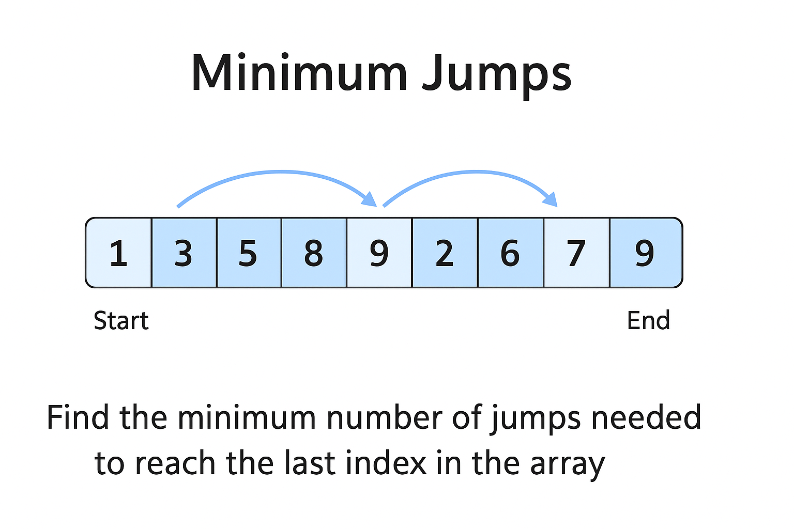

Absolutely! Here's a clear breakdown of the **Minimum Jumps** problem:

---

### 🧠 Problem Intuition:

You are given an array `arr[]` of **non-negative integers**.  
Each element `arr[i]` tells you the **maximum number of steps you can jump forward** from that position.

Your task is to find the **minimum number of jumps** needed to reach the **last index** starting from the first one.

---

### 🔠Rules:

- From any index `i`, you can jump to:
  ```
  i + 1, i + 2, ..., i + arr[i]
  ```
- You must land **within bounds** (i.e., less than array size).
- If you **can't move forward** at some point (`arr[i] == 0`), you're stuck.
- If it's **impossible** to reach the end, return `-1`.

---

### 📦 Example 1:

```
arr = [1, 3, 5, 8, 9, 2, 6, 7, 6, 8, 9]
```

- Start at index 0 (`arr[0] = 1`) → you can jump to index 1.
- At index 1 (`arr[1] = 3`) → you can jump to index 2, 3, or 4.
- The best move: jump to index 4 (`arr[4] = 9`)
- From index 4, jump directly to the end.

✅ Total jumps = 3  
**Path:** 0 → 1 → 4 → end

---

### 📦 Example 2:

```
arr = [1, 4, 3, 2, 6, 7]
```

- Start at 0 → jump to 1
- From 1 (`arr[1] = 4`) → you can reach the end directly

✅ Total jumps = 2

---

### 📦 Example 3:

```
arr = [0, 10, 20]
```

- You start at index 0, but `arr[0] = 0`, so you can’t move.
⌠You're stuck → return `-1`

---

### 💡 Visual step-by-step diagram:
Use the **fewest jumps** to go from the **first element** to the **last**.

---

This is the **Minimum Jumps to Reach End** problem — a classic greedy problem.

---

### ✅ Problem Summary:
- You're given an array `arr[]` of non-negative integers.
- Each element `arr[i]` represents the **maximum number of steps** you can jump forward.
- Your goal: **Return the minimum number of jumps** to reach the **last index**.
- If you can't reach the end, return `-1`.

---

Sure! Here's the **Python implementation** of the **Minimum Jumps to Reach End** problem using the **greedy approach** with `O(n)` time and `O(1)` space:

---
Sure! Here's the **C++ implementation** of the **Minimum Jumps to Reach End** problem using a **greedy algorithm**:

---

### ✅ C++ Code (O(n) Time, O(1) Space):
```cpp
#include <vector>
#include <iostream>
using namespace std;

int minJumps(const vector<int>& arr) {
    int n = arr.size();
    if (n <= 1) return 0;
    if (arr[0] == 0) return -1;

    int jumps = 1;
    int maxReach = arr[0];
    int steps = arr[0];

    for (int i = 1; i < n; ++i) {
        if (i == n - 1) return jumps;

        maxReach = max(maxReach, i + arr[i]);
        steps--;

        if (steps == 0) {
            jumps++;
            if (i >= maxReach) return -1;
            steps = maxReach - i;
        }
    }

    return -1;
}
```

---

### 🧪 Example Usage:
```cpp
int main() {
    vector<int> arr1 = {1, 3, 5, 8, 9, 2, 6, 7, 6, 8, 9};
    vector<int> arr2 = {1, 4, 3, 2, 6, 7};
    vector<int> arr3 = {0, 10, 20};

    cout << minJumps(arr1) << endl; // Output: 3
    cout << minJumps(arr2) << endl; // Output: 2
    cout << minJumps(arr3) << endl; // Output: -1

    return 0;
}
```

---

### ✅ Python Code:
```python
def minJumps(arr):
    n = len(arr)
    
    if n <= 1:
        return 0
    if arr[0] == 0:
        return -1

    jumps = 1
    maxReach = arr[0]
    steps = arr[0]

    for i in range(1, n):
        if i == n - 1:
            return jumps

        maxReach = max(maxReach, i + arr[i])
        steps -= 1

        if steps == 0:
            jumps += 1
            if i >= maxReach:
                return -1
            steps = maxReach - i

    return -1
```

---

### 🧪 Example Usage:
```python
print(minJumps([1, 3, 5, 8, 9, 2, 6, 7, 6, 8, 9]))  # Output: 3
print(minJumps([1, 4, 3, 2, 6, 7]))                # Output: 2
print(minJumps([0, 10, 20]))                       # Output: -1
```

---

### ✅ JavaScript Code (Greedy, O(n) Time & O(1) Space):
```javascript
function minJumps(arr) {
    const n = arr.length;
    if (n <= 1) return 0;
    if (arr[0] === 0) return -1;

    let jumps = 1;
    let maxReach = arr[0];
    let steps = arr[0];

    for (let i = 1; i < n; i++) {
        if (i === n - 1) return jumps;

        maxReach = Math.max(maxReach, i + arr[i]);
        steps--;

        if (steps === 0) {
            jumps++;
            if (i >= maxReach) return -1;
            steps = maxReach - i;
        }
    }

    return -1;
}
```

---

### 🧪 Example Usage:
```javascript
console.log(minJumps([1, 3, 5, 8, 9, 2, 6, 7, 6, 8, 9])); // Output: 3
console.log(minJumps([1, 4, 3, 2, 6, 7]));               // Output: 2
console.log(minJumps([0, 10, 20]));                      // Output: -1
```

---

### â± Time & Space Complexity:
- **Time:** `O(n)` — one pass through the array.
- **Space:** `O(1)` — constant space used.

---