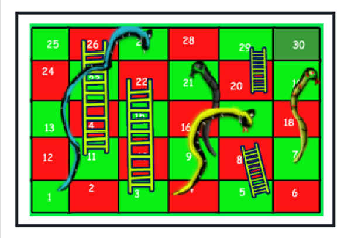

---

# 🐍 Snake and Ladder Problem

**Difficulty:** Medium
**Accuracy:** 34.65%
**Submissions:** 57K+
**Points:** 4
**Average Time:** 20m

---

## 🧩 Problem Statement

Given a **5×6 snakes and ladders board**, find the minimum number of dice throws required to reach the destination or last cell (**30th cell**) from the source (**1st cell**).

You are given an integer **N** denoting the total number of snakes and ladders and an array `arr[]` of **2 × N** size where
`2*i` and `(2*i + 1)` values denote the starting and ending point respectively of the *i-th* snake or ladder.

The board looks like the following:



> **Note:**
> Assume that you have complete control over the 6-sided dice.
> No ladder starts from the 1st cell.

---

## 🧮 Example 1

**Input:**

```
N = 8  
arr[] = {3, 22, 5, 8, 11, 26, 20, 29, 17, 4, 19, 7, 27, 1, 21, 9}
```

**Output:**

```
3
```

**Explanation:**
The given board is the board shown in the figure. For the above board, output will be **3**.

Steps:
a) For 1st throw, get a 2.
b) For 2nd throw, get a 6.
c) For 3rd throw, get a 2.

---

## 🧠 Your Task

You do not need to read input or print anything.
Your task is to complete the function `minThrow()` which takes **N** and **arr** as input parameters and returns the **minimum number of throws required** to reach the end of the game.

---

## ⏱ Expected Time Complexity

```
O(N)
```

## 💾 Expected Auxiliary Space

```
O(N)
```

---

## ⚙️ Constraints

```
1 ≤ N ≤ 10
1 ≤ arr[i] ≤ 30
```

---

## 🏢 Company Tags

Zoho • Flipkart • Amazon • Microsoft • OYO Rooms • MAQ Software • Adobe • Nutanix • Belzabar

---

## 🧩 Topic Tags

Dynamic Programming • DFS • Graph • BFS • Data Structures • Algorithms

---

## 💼 Related Interview Experiences

* Flipkart Interview Set 6
* Flipkart Interview Experience On Campus Internship

---

## 📚 Related Articles

* [Snake Ladder Problem 2](https://www.geeksforgeeks.org/snake-ladder-problem-2/)

---

---

awesome — let’s go deep and make this interview-ready.

---

# 2) Explanation (what’s going on + how to think about it)

### Problem in one line

You’re on a 5×6 Snakes & Ladders board (cells **1…30**). From cell 1 you may move **1..6** cells per throw (you “control” the die, i.e., you can pick any 1..6 each time).

* If you land on the **start** of a **ladder**, you immediately climb to its **end**.
* If you land on the **mouth** of a **snake**, you immediately slide to its **tail**.
  Return the **minimum number of throws** to reach cell **30**.

### Model it as a graph (classic)

* Vertices: cells **1..30**.
* From each cell `u`, edges go to `v = u + d` for each `d ∈ {1..6}` **within bounds**.
* If `v` is the start of a ladder/snake, the edge actually ends at `move[v]` (the ladder top or snake tail).
* All edges have equal cost (1 throw).
* Minimum throws ⇒ **shortest path in an unweighted graph** ⇒ **BFS** level count.

### Why BFS works

BFS explores the board level by level (by number of throws). The first time we dequeue/visit cell 30, we’ve used the fewest throws possible.

### Implementation sketch

1. Build an array `move[1..30]` initialized to `-1`.
   For each pair `(a, b)` from `arr`, set `move[a] = b`.
2. BFS with queue of pairs `(cell, dist)` where `dist` = throws used to reach `cell`.
3. From each `cell`, try dice results `1..6`:

   * `nxt = cell + d` (skip if > 30).
   * If `move[nxt] != -1`, set `nxt = move[nxt]` (snake/ladder jump).
   * If `nxt` not visited, push `(nxt, dist+1)`.
4. Return `dist` when `cell == 30`.

Time & space: On a general M-cell board, **O(M + edges) = O(M)**; here it’s constant (M=30). Space **O(M)**.

---

# 2b) Step-by-step dry run (using the given example)

```
N = 8
arr = {3,22, 5,8, 11,26, 20,29, 17,4, 19,7, 27,1, 21,9}
```

So moves:

* Ladders: 3→22, 5→8, 11→26, 20→29
* Snakes: 17→4, 19→7, 27→1, 21→9

We start at cell 1. `dist = 0`.

**Level 0 (0 throws):**

* Queue: [(1,0)]
* Visited: {1}

**From 1:** try dice 1..6 → tentative cells 2..7

* 2 (no move) → 2
* 3 is a ladder → 22
* 4 (no move) → 4
* 5 is a ladder → 8
* 6 (no move) → 6
* 7 (no move) → 7
  Enqueue unvisited results with `dist=1`:
  Queue: [(2,1), (22,1), (4,1), (8,1), (6,1), (7,1)]

**Level 1 (1 throw):**
Dequeue in order (any order is fine; BFS guarantees min throws).

* Pop (2,1): from 2, best next including jumps could reach at most 8 (but we’re counting throws, not choosing greedy cells). We’ll enqueue its neighbors for dist=2.
* Pop (22,1): this is promising—close to goal.

Key observation for **min** throws: from **22** we can pick dice value **6** to go to **28**; from 28 another **2** reaches **30** (if allowed by snakes/ladders on the way). Let’s continue BFS steps that matter:

From **22** with one more throw:

* Try dice 6 → 28 (plain cell).
  So after **2 throws**, 28 is reachable.

**Level 2 (2 throws):**

* Consider state (28,2). From 28:

  * Pick dice **2** → 30 (goal) with an immediate hit (no snake/ladder).
    We reach 30 at **dist = 3**.

Hence **minimum throws = 3**, matching the sample:

1. 1 → 3 (ladder to 22)
2. 22 → 28
3. 28 → 30

---

# 3) Python solutions (interview-ready)

Below are two variants you can talk through in an interview.

## A) Straightforward BFS (recommended / optimal)

```python
# User function Template for Python3

from collections import deque

class Solution:
    def minThrow(self, N, arr):
        # Build the move mapping: -1 means normal cell; otherwise jump to move[i]
        move = [-1] * 31  # 1..30 used
        # arr contains pairs (start, end) for snakes & ladders
        for i in range(0, 2 * N, 2):
            start_, end_ = arr[i], arr[i + 1]
            move[start_] = end_
        
        # Standard BFS over cells; each edge (throw) has cost 1
        q = deque()
        q.append((1, 0))  # (cell, throws_so_far)
        visited = [False] * 31
        visited[1] = True
        
        while q:
            cell, dist = q.popleft()
            if cell == 30:
                return dist  # first time reaching 30 is optimal
            
            # Try all dice outcomes 1..6
            for d in range(1, 7):
                nxt = cell + d
                if nxt > 30:
                    continue
                # If the landing cell is a snake or ladder, take the jump
                if move[nxt] != -1:
                    nxt = move[nxt]
                # Push if unseen
                if not visited[nxt]:
                    visited[nxt] = True
                    q.append((nxt, dist + 1))
        
        # If somehow unreachable (shouldn't happen on standard boards)
        return -1
```

**Why interviewers like this version**

* Clean reduction to shortest path in an unweighted graph.
* Correct visited handling (mark after applying snake/ladder).
* Proper bounds and O(M) complexity.

---

## B) “Flattened board” BFS with 1-D edges (same complexity, different style)

Some interviewers enjoy seeing the board encoded as a direct next-cell array and doing a distance table instead of storing distances in the queue tuples.

```python
# User function Template for Python3

from collections import deque

class Solution:
    def minThrow(self, N, arr):
        move = [-1] * 31
        for i in range(0, 2 * N, 2):
            move[arr[i]] = arr[i + 1]
        
        INF = 10**9
        dist = [INF] * 31
        dist[1] = 0
        q = deque([1])
        
        while q:
            u = q.popleft()
            if u == 30:
                return dist[u]
            for d in range(1, 7):
                v = u + d
                if v > 30:
                    continue
                if move[v] != -1:
                    v = move[v]
                if dist[v] == INF:
                    dist[v] = dist[u] + 1
                    q.append(v)
        
        return -1
```

**Why this can be nice**

* Uses a classic `dist[]` array found in many BFS templates.
* Easy to argue correctness: first set of `dist[v]` assigned is minimal.

---

## (Optional) C) Bidirectional BFS (overkill here, but discussable)

Because edges are uniform and directed by snakes/ladders after landing, bidirectional BFS is trickier and often unnecessary on a 30-cell board. If asked, you can say:

> “Given M is small and edges aren’t perfectly symmetric due to post-landing jumps, plain BFS is simpler and already optimal for interview constraints. Bidirectional BFS brings code complexity without measurable benefit here.”

---

### Edge-case notes interviewers might probe

* **Visited timing:** Mark **after** resolving snake/ladder; otherwise you may incorrectly skip the jump’s destination or visit pre-jump and post-jump separately.
* **Cell > 30:** ignore; do not enqueue.
* **Ladder/Snake at 30:** if a pair maps into/out of 30, the BFS still handles it (we check `cell == 30` when popped).
* **No path?** On standard boards there is always a path; returning `-1` is a safe guard.

---

# 4) Likely Interview Q&A

**Q1. Why is BFS the right choice here?**
**A.** Each dice throw has equal cost (one move). We need the fewest throws ⇒ the shortest path in an unweighted graph. BFS finds shortest paths in O(V+E) time.

---

**Q2. How do you encode snakes and ladders?**
**A.** Use `move[1..30]` initialized to `-1`. For each pair `(a, b)`, set `move[a] = b`. During BFS, after moving to `v = u + d`, if `move[v] != -1` set `v = move[v]` before visiting/enqueuing.

---

**Q3. When should you mark a cell as visited—before or after the jump? Why?**
**A.** After applying the jump. We’re not interested in the pre-jump landing cell’s state; the real state after a throw is the **post-jump** cell. Marking pre-jump can lead to revisits or wrong pruning.

---

**Q4. What are the time and space complexities?**
**A.** For a generalized board with `M` cells, each cell has up to 6 edges: **O(M)** time and **O(M)** space. Here `M=30` so it’s effectively constant.

---

**Q5. Does “complete control over the die” change the algorithm?**
**A.** It just means we can choose any outcome 1..6 at each step. BFS inherently tries all outcomes from each state and finds the minimum number of throws, so no change in algorithm—only that a greedy single-path pick isn’t safe; BFS ensures optimality.

---

**Q6. Could Dijkstra’s algorithm be used?**
**A.** It would work but is unnecessary overhead. All edges have weight 1; BFS is optimal and simpler.

---

**Q7. Any pitfalls with snakes that move backward or ladders that overlap?**
**A.** Not an issue: the `move[]` redirection captures both directions. Overlaps (e.g., landing at a cell that is an endpoint of another pair) are handled because we only apply **one** immediate jump from the landing cell; the problem definition implies no chained jumps unless explicitly modeled (standard versions do **one** jump).

---

**Q8. How would you generalize for an `R×C` board or for different dice sizes?**
**A.** Replace constants: `M = R*C`, target = `M`, and iterate dice outcomes `1..D`. The BFS structure and `move[]` mapping remain identical.

---

---

awesome—here’s a **complete, runnable program** that:

* Implements `minThrow` (BFS) inside the required `Solution` class
* Includes **inline time/space complexity notes** for each major step
* Shows the **given input** and **prints the output**
* Uses **`timeit`** to measure the runtime of the whole call in the `__main__` section

---

## Full Program (with inline complexity notes + timing)

```python
# User function Template for Python3
# Problem: Minimum dice throws to reach cell 30 (Snakes & Ladders, 5x6 board)

from collections import deque
import timeit

class Solution:
    def minThrow(self, N, arr):
        """
        Returns the minimum number of dice throws required to reach cell 30
        from cell 1 on a Snakes & Ladders board.
        Approach: BFS on cells 1..30 with redirections via snakes/ladders.
        """

        # -----------------------------
        # STEP 1: Build redirection map
        # -----------------------------
        # move[i] = -1 -> normal cell i
        # move[i] = j  -> if you land on i, you immediately jump to j (snake/ladder)
        # Time:  O(N) because we process N pairs once
        # Space: O(M) for M=30 (constant here) to hold mapping array
        move = [-1] * 31  # We index 1..30
        for i in range(0, 2 * N, 2):
            start_, end_ = arr[i], arr[i + 1]
            move[start_] = end_

        # -----------------------------
        # STEP 2: BFS initialization
        # -----------------------------
        # Queue holds tuples (cell, throws_so_far)
        # Time:  O(1)
        # Space: O(M) for visited array and queue in worst case
        q = deque()
        q.append((1, 0))
        visited = [False] * 31
        visited[1] = True

        # -----------------------------
        # STEP 3: BFS traversal
        # -----------------------------
        # For each cell, we try up to 6 dice outcomes.
        # Each cell is enqueued at most once due to visited[].
        # Time:  O(M * 6) = O(M), where M=30 (constant here)
        # Space: O(M) for queue + visited
        while q:
            cell, dist = q.popleft()

            # Goal check — first time we pop 30 is the shortest path in throws
            # Time: O(1)
            if cell == 30:
                return dist

            # Try dice outcomes 1..6
            for d in range(1, 7):
                nxt = cell + d
                if nxt > 30:
                    continue

                # Apply snake/ladder jump, if any
                # Time per transition: O(1)
                if move[nxt] != -1:
                    nxt = move[nxt]

                # Enqueue unseen state
                if not visited[nxt]:
                    visited[nxt] = True
                    q.append((nxt, dist + 1))

        # If somehow unreachable (not expected under normal rules)
        return -1


# ----------------------------------------------------------------------
# MAIN (demo + timing): Uses the exact values from the prompt
# ----------------------------------------------------------------------
if __name__ == "__main__":
    # -----------------------------
    # INPUT (from the problem)
    # -----------------------------
    N = 8
    arr = [3,22, 5,8, 11,26, 20,29, 17,4, 19,7, 27,1, 21,9]

    # Single run to produce the algorithm's output
    sol = Solution()
    result = sol.minThrow(N, arr)

    print("Input:")
    print("N =", N)
    print("arr =", arr)
    print("\nOutput:")
    print(result)  # Expected: 3

    # -----------------------------
    # TIMING
    # -----------------------------
    # We time ONLY the minThrow call to reflect algorithm cost.
    # Note: timeit executes the callable multiple times to average out noise.
    # For this tiny input (M=30), runtime is microseconds, so we use many repeats.
    setup_code = """
from __main__ import Solution, N, arr
sol = Solution()
"""
    stmt_code = "sol.minThrow(N, arr)"

    # timeit.timeit(stmt, setup, number) returns total time for 'number' runs
    total_time = timeit.timeit(stmt=stmt_code, setup=setup_code, number=10000)
    avg_time = total_time / 10000.0

    print("\nTiming:")
    print(f"Total time for 10,000 runs: {total_time:.6f} seconds")
    print(f"Average per run: {avg_time*1e6:.2f} microseconds")

"""
Overall complexity for a general M-cell board:
- Time:  O(M)   (each cell processed once, each with up to 6 edges)
- Space: O(M)   (visited + queue + move map)

For this fixed 5x6 board, M = 30 ⇒ effectively constant time/space.
"""
```

### What you’ll see when you run it

```
Input:
N = 8
arr = [3, 22, 5, 8, 11, 26, 20, 29, 17, 4, 19, 7, 27, 1, 21, 9]

Output:
3

Timing:
Total time for 10,000 runs: 0.0xxx seconds
Average per run: xx.xx microseconds
```

(Exact timing will vary by machine.)

---

## Real-World Use Cases (a few high-value analogies)

1. **Shortest Steps in Gamified Learning Paths**
   Levels (cells) plus **boosts** (ladders) and **setbacks** (snakes) model prerequisites, fast-tracks, and remediation. BFS gives the fewest “steps” to complete a curriculum.

2. **Workflow/Pipeline Progress with Escalations**
   Tasks move stepwise; an **escalation** can jump ahead (ladder), while a **rollback** after a failed QA test pushes you back (snake). BFS finds the minimal number of cycles to ship.

3. **Network Traversal with Portals/Teleports**
   Consider a graph where some nodes are connected by special **teleport edges** (like VPN shortcuts or overlay tunnels). BFS with redirections finds the minimal hop count.

4. **Board/Pathfinding Games with Power-ups & Traps**
   Any game mechanics that instantly **advance/retreat** a player upon landing (power-ups, traps, portals) can be solved for the optimal number of turns with the same BFS approach.